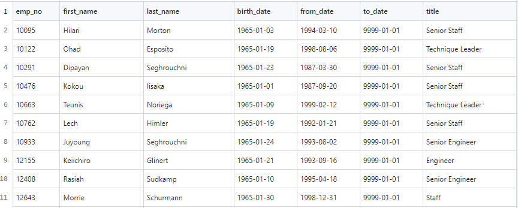

# Pewlett-Hackard-Analysis

## Overview

Everyday people in the workforce reach retirement and exit their positions. Collecting data on who, when, and how many people will be retiring within a company is crucial. Having this information available will better help a company prepare for the future and to fill positions that will become vacant.

### Purpose

Using employee data and SQL, create tables to determine the number of retiring employees by title and identify employees that are eligible to partcipate in a mentorship program.

## Analysis

### The Number of Retiring Employees by Title

The eligibility of retiring employees was determined by their birthdates being between January 1, 1952 and December 31, 1955. 
Overall, around 90,000 employees are eligibile to retire. Of that, the job title Senior Engineer holds the highest number of retiring employees, while the title Manager only has 2 eligible employees.

Going forward the company can use this information to determine what job titles will need to be filled and how many new hires or promotions will be necessary.

Two specific take aways from the table:
- Senior Engineers: 29,414 are eligible for retirement. This can cause a huge upset within the company. Properly hiring new employees to take over is extremely important within this job title. There could be a significant opportunity to promote current Engineers within the company and subsidize the loss of staff via hiring new Engineers.
- Managers: Although there are only two ritirement eligible employees under this job title, managers hold an important role. There also tends to be less managers then other job titles, for example Staff. So despite the small count, replacing managers can be just as important. 

### Employees Eligible for the Mentorship Program

A sample of the membership eligibility table:

There are roughly 1,550 employees that are eligible for the mentorship program. The significant number of these individuals hold specialized/ senior job titles. 

From this information, there are a few takeaways:
- The eligible employees overall are qualified to mentor the next generation
- Not all of the 1,550 employees will participate in the mentorship program. This is important to note because in the previous analysis, there could be potentionally be 90,000 new hires/ promotions while only having a max of 1,550 mentors

## Summary

There are roughly 90,000 employees that are soon to retire. This will most definitely cause a 'silver tsunami' throughout the company. These roles will either be consolidated with other roles or replaced with new hires/ promotions within the company. Keep in mind, promoting within the company will leave behind a job position in the previous department that will most likely need to be filled and consolidating roles is not a solution for most senior job positions. Without this analysis of retiring employees, the mass exodus could potentionally have shocked the company as a whole with catastrophic consequences. However, knowing the retirement eligibile employees allows the company to prepare and start hiring before the metaphorical tsunami hits. 

A mentorship program can help alleviate the pressure of training and preparing new hires/ teams in the company. There are roughly 1,550 eligible employees for the mentorship program. A significant number of these individuals hold specialized/ senior job titles. There appears to be qualified, retirement ready eligible mentors. However, not all eligible employees will join the mentorship program. If all eligible employees did join the program, they could potentionally have 90,000 new employees to mentor. That is roughly 58 employees to one mentor. A mentorship program alone might not be enough to handle the potentional influx of new employees. 

Additional queries that could help further the analysis:
- Run a query on the Salaries of retirement eligible employees: 
  - This could be useful when determining budget for new hires/ promotions
- Run a query on the average number of promotions (job title changes) retirement eligible employees and previous employees have recieved in comparison to their job titles
  - This could provide insight into whether promoting from within the company has been successful in the past for certain job titles. 
