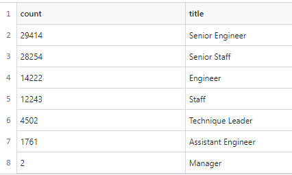

# Pewlett-Hackard-Analysis

## Overview

Everyday people in the workforce reach retirement and exit their positions. Collecting data on who, when, and how many people will be retiring within a company is crucial. Having this information available will better help a company prepare for the future and to fill positions that will become vacant.

### Purpose

Using employee data and SQL, create tables to determine the number of retiring employees by title and identify employees that are eligible to partcipate in a mentorship program.

## Analysis

### The Number of Retiring Employees by Title

The eligibility of retiring employees was determined by their birthdates being between January 1, 1952 and December 31, 1955. 
Overall, around 90,000 employees are eligibile to retire. Of that, the job title Senior Engineer holds the highest number of retiring employees, while the title Manager only has 2 eligible employees.

Going forward the company can use this information to determine what job titles will need to be filled and how many new hires or promotions will be necessary.
- Senior Engineers: 29,414 are eligible for retirement. This can cause a huge upset within the company. Properly hiring new employees to take over is extremely important within this job title. There could be a significant opportunity to promote current Engineers within the company and subsidize the loss of staff via hiring new Engineers.
- Managers: Although there are only two ritirement eligible employees under this job title, managers hold an important role. There also tends to be less managers then other job titles, for example Staff. So despite the small count, replacing managers can be just as important. 
